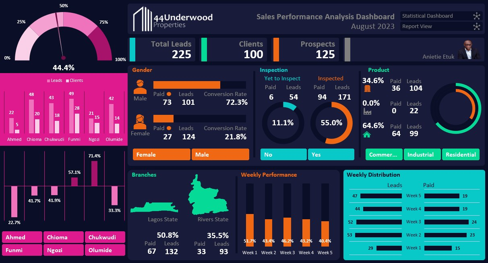
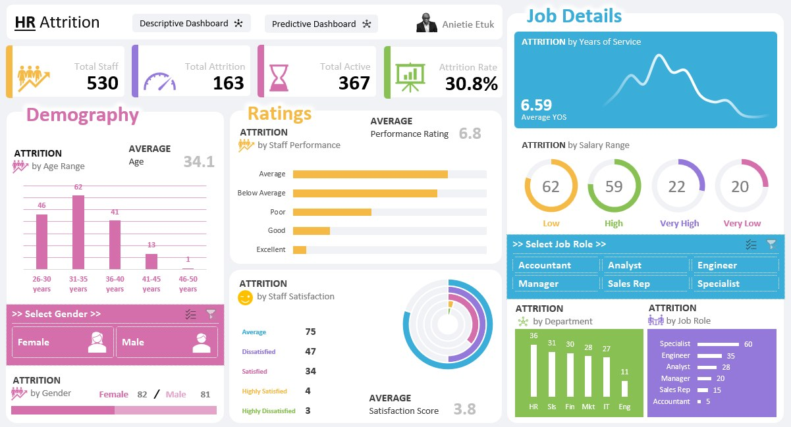

<!--Section 1: Introduce your self-->
## ABOUT ME

Hi there! I'm Anietie Etuk 😎🤓, a data analyst, educator, and consultant with a passion for turning data into actionable insights. With experience across sales, operations, finance, engineering, transportation, health, and customer service, I help businesses solve challenges and unlock growth.

As the Chief Analyst of SkillAhead Solutions LTD, I provide consulting and training services to help companies harness the power of their data. Whether I’m optimizing data for businesses or mentoring aspiring analysts, I’m all about making data work for you.

Let’s connect and see how we can make a difference together!

<!--Mention your top/relevant skills here - core and soft skills-->
## WHAT I DO
**- ✅ Data Analytics Consulting.**
Unlock the full potential of your data with expert consulting services. I provide in-depth analysis and tailored solutions to help you make data-driven decisions, optimize processes, and drive business growth. Whether you need to optimize performance, increase sales, analyze procurement data, forecast trends, or improve customer support, I’m here to guide you every step of the way.

**- ✅ Staff Training & Development.**
Empower your team with the skills they need to thrive in today’s data-driven world. I offer comprehensive training programs in data analysis, visualization, and data-driven decision-making. From beginner to advanced levels, I’ll equip your staff with the tools and knowledge to excel in their roles.

<!--Section 2: List 3-4 key projects-->
## MY PORTFOLIO 

*A glimpse of some of the projects I've been working on.*

**Predictive Modeling and Hypothesis Testing using Titanic Dataset.**

The sinking of the Titanic is one of the most infamous shipwrecks in history.
On April 15, 1912, during her maiden voyage, the widely considered “unsinkable” RMS Titanic sank after colliding with an iceberg. Unfortunately, there weren’t enough lifeboats for everyone onboard, resulting in the death of 1502 out of 2224 passengers and crew. 

[Read More](https://www.linkedin.com/pulse/predictive-modeling-hypothesis-testing-using-titanic-dataset-anietie/)

**Predictive Modeling and Hypothesis Testing using Titanic Dataset.**

The sinking of the Titanic is one of the most infamous shipwrecks in history.
On April 15, 1912, during her maiden voyage, the widely considered “unsinkable” RMS Titanic sank after colliding with an iceberg. Unfortunately, there weren’t enough lifeboats for everyone onboard, resulting in the death of 1502 out of 2224 passengers and crew. 

[Read More](https://www.linkedin.com/pulse/predictive-modeling-hypothesis-testing-using-titanic-dataset-anietie/)

**Predictive Modeling and Hypothesis Testing using Titanic Dataset.**

The sinking of the Titanic is one of the most infamous shipwrecks in history.
On April 15, 1912, during her maiden voyage, the widely considered “unsinkable” RMS Titanic sank after colliding with an iceberg. Unfortunately, there weren’t enough lifeboats for everyone onboard, resulting in the death of 1502 out of 2224 passengers and crew. 

[Read More](https://www.linkedin.com/pulse/predictive-modeling-hypothesis-testing-using-titanic-dataset-anietie/)

**Predictive Modeling and Hypothesis Testing using Titanic Dataset.**

The sinking of the Titanic is one of the most infamous shipwrecks in history.
On April 15, 1912, during her maiden voyage, the widely considered “unsinkable” RMS Titanic sank after colliding with an iceberg. Unfortunately, there weren’t enough lifeboats for everyone onboard, resulting in the death of 1502 out of 2224 passengers and crew. 

[Read More](https://www.linkedin.com/pulse/predictive-modeling-hypothesis-testing-using-titanic-dataset-anietie/)

<!--Section 3: This section is optional. You can replace this section with a list of your core skills-->
## MY COURSES
*You can get these courses today.*

**Performance Analysis**

Advanced Data Analytics: Mastering the Craft with Portfolio Project using Excel. Master data analytics by solving real-world sales problems using MS Excel 2021, learn core dashboard design and presentation skills and create your portfolio project. This course is designed for beginners and professional data analyst.

[Get this course](https://selar.co/salesdata)

**Attrition Analysis**

In this course, you will learn how to analyze HR and employee data, including demographics, job roles, performance metrics, and workplace satisfaction, to identify the underlying causes and predictors of employee attrition.

[Get this course](https://selar.co/q688i7)

# Data Analytics Coach
Driven by Excellence

<table>
  <thead>
    <tr>
      <th colspan="2">
        Contact Details/CV
      </th>
    </tr>
  </thead>
  <tbody>
    <tr>
      <td>📧</td>
      <td><a href="mailto:anietieetuk@gmail.com">anietieetuk@gmail.com</a></td>
    </tr>
    <tr>
      <td>📞</td>
      <td>(234) 816-763-7212</td>
    </tr>
    <tr>
      <td>📍</td>
      <td>PH, Nigeria</td>
    </tr>
    <tr>
      <td>⬇️</td>
      <td><a href="https://etuk123456.github.io/portfolio1/docs/Profile.pdf">Download my CV</a></td>
    </tr>
    <tr>
      <td>🌐</td>
      <td><a href="https://linkedin.com/in/etukanietie">The things I do daily on LinkedIn</a></td>
    </tr>
  </tbody>
</table>

#### Technical Skills: Python, SQL, AWS, Snowflake, MATLAB

| Column 1 | Column 2 | Column 3 |
| --- | --- | --- |
| Row 1, Column 1 | Row 1, Column 2 | Row 1, Column 3 |
| Row 2, Column 1 | Row 2, Column 2 | Row 2, Column 3 |

## Education
- Ph.D., Physics | The University of Texas at Dallas (_May 2022_)								       		
- M.S., Physics	| The University of Texas at Dallas (_December 2019_)	 			        		
- B.S., Physics | The University of Texas at Dallas (_May 2017_)

## Talks & Lectures
- Causality: The new science of an old question - GSP Seminar, Fall 2021
- Guest Lecture: Dimensionality Reduction - Big Data and Machine Learning for Scientific Discovery (PHYS 5336), Spring 2021
- Guest Lecture: Fourier and Wavelet Transforms - Scientific Computing (PHYS 5315), Fall 2020
- A Brief Introduction to Optimization - GSP Seminar, Fall 2019
- Weeks of Welcome Poster Competition - UTD, Fall 2019
- A Brief Introduction to Networks - GSP Seminar, Spring 2019

- [Data Science YouTube](https://www.youtube.com/channel/UCa9gErQ9AE5jT2DZLjXBIdA)

